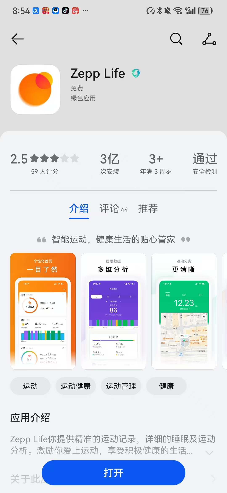

# 微信运动、支付宝刷步小程序操作手册

## 项目介绍
刷步小程序是一个通过修改微信运动、支付宝应用的步数，实现修改步数向朋友展示并能够捐赠公益金的项目。
用户可以轻松地修改自己的步数数据，显示更高的运动成果，同时可以将这些步数转换为公益金，支持公益项目。

## 1.下载并注册zepplifeAPP

苹果手机和安卓手机均可在应用商店搜索zepplife并下载，图标如下所示

按照提示填入自己的邮箱和设置密码进行注册账号

### 操作步骤
注意：在此之前检查自己微信运动是否开启

1）打开我的

2）点击第三方接入

3）点击微信：拿出微信扫描二维码关注公众号以绑定账号用来上传步数

4)绑定后回到zepplifeAPP界面绑定支付宝

5)按照提示跳转支付宝完成支付宝的绑定

6）到此支付宝和微信已经绑定成功了

## 变量格式

1）zepplife账号：注册时设置的邮箱

2）zepplife密码：注册时设置的密码

3）最小期望步数：自己想要的最小步数

4）最大期望步数：自己想要的最大步数（微信运动的极限：98800，建议70000以内超过容易被系统检测）

